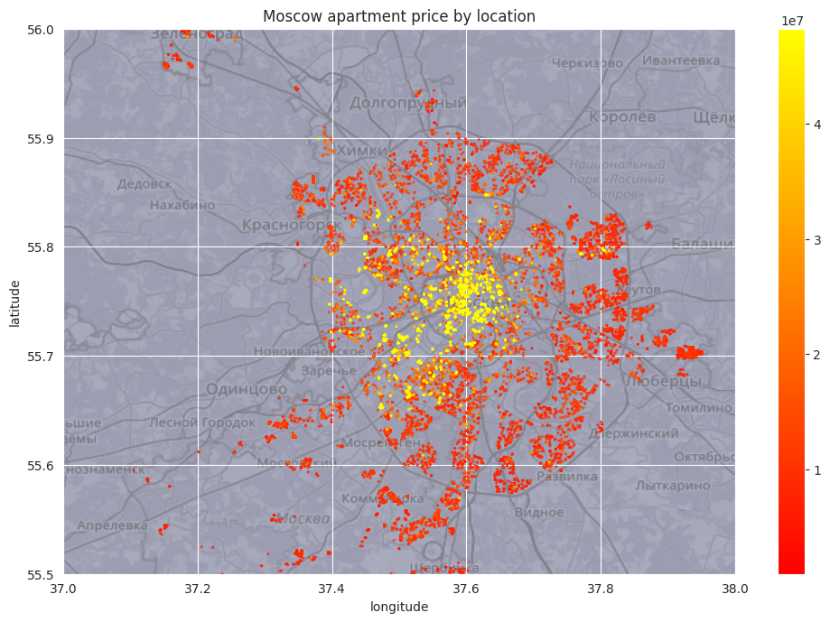

# Prediction of Apartment Prices with Machine Learning
This project is related to a [Kaggle competition](https://www.kaggle.com/competitions/moscow-housing-tdt4173/overview) and is about predicting the prices of apartments located in and around the city centre of Moscow in Russia. Our team reached the top 5 in the public rankings out of 61 participating teams. We utilized several state of the art machine learning architectures like LGBM, CatBoost, and XGBoost and used scikit-learn to build a final ensemble regression model.

## Project Structure
The notebook `eda_notebook.ipynb` describes the approach we used to solve the house pricing regression problem and contains the exploratory data analysis as well as the references we used for researching about the russian house market.

The notebook `final_model.ipynb` implements the most effective strategies which were found during EDA. It includes preprocessing, feature engineering, as well as the final model used for prediction of the house prices.

## Dataset
The initial dataset was given by a [Kaggle competition](https://www.kaggle.com/competitions/moscow-housing-tdt4173/overview) and consists of information about over 33,000 apartments in Moscow. It contains around 30 variables that encode data such as location, facilities, and building information. It can be found in the `./data` folder which contains the following files:

- `apartments_train.csv` - Training set apartments
- `apartments_test.csv` - Testing set apartments
- `buildings_train.csv` - Extra building information for training set apartments
- `buildings_test.csv` - Extra building information for testing set apartments
- `apartments_meta.json` - Metadata about columns in apartments (train/test)
- `buildings_meta.json` - Metadata about columns in buildings (train/test)

Furthermore, we found and used the following external datasets:
- `metro_stations.csv` - location data of metro stations extracted from [wikipedia](https://en.wikipedia.org/wiki/List_of_Moscow_Metro_stations)
- `sberbank.csv` - additional location data and features to apartments from another [Kaggle competition](https://www.kaggle.com/c/sberbank-russian-housing-market/data)
- `sberbank_sub_areas.csv` - location data of sub areas in Moscow from another [Kaggle competition](https://www.kaggle.com/c/sberbank-russian-housing-market/data)

The image below gives a rough overview of the apartment locations and the corresponding prices contained in the Kaggle dataset:

